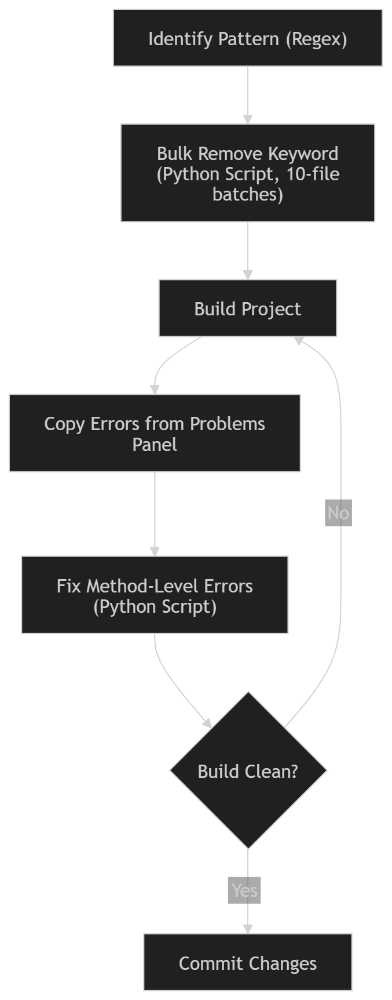

## Why Tech Debt Stays Unresolved

Most projects carry tech debt that never gets fixed. Not because developers ignore it, but because the effort rarely justifies the reward. Two common patterns:

- A library update that requires the same small change repeated across hundreds of files
- A code pattern (e.g. wrong use of `static`) that silently hurts performance or testability

Fixing these manually is tedious. AI tools seem like the answer, but used naively, they cause two problems:

- **Inconsistency**: the same prompt gives different results on similar files
- **Wrong scope**: AI either under-reads the problem or pulls in too much context

## The Scenario

An xUnit test project uses `static` fields and methods throughout. These should be instance members. The result: objects stay in memory for the entire test suite lifetime instead of being cleaned up between tests.

> This is a controlled example. The memory impact is modest, but it demonstrates how AI can be used systematically to fix a repeated pattern across an entire codebase.

## The Workflow

The key idea: break the refactor into small, deterministic steps. Use AI only to generate tools (regex, scripts), not to make decisions about the code. Here is how the flow shall look like



---

## Step 1 — Identify the Pattern

**Prompt:**
```
Give me a regular expression to identify static fields in a file
following C# syntax rules.
```

Use the regex in VS Code or Vim to search the project. Verify it matches only what you intend before touching any files.

---

## Step 2 — Remove the Keyword in Batches

**Prompt:**
```
Generate a Python script that removes the static keyword matching
<your regex> from all .cs files, processing 10 files at a time and
waiting for user confirmation before continuing.
```

Review the script output before running it. Work in batches so you can check the result after each round. Everything is in git, so rollback is straightforward.

**Pitfall:** Some `static` declarations are intentional. Shared state across tests, constants, or singleton-style test fixtures are valid uses of `static`. The script will not know the difference. If you remove a `static` that was there for a reason, the build may pass but tests may fail or behave incorrectly. Keep an eye on test results after each batch and be ready to revert specific files via git if needed.

---

## Step 3 — Fix Compilation Errors

Removing `static` will produce [CS0120](https://learn.microsoft.com/en-us/dotnet/csharp/language-reference/compiler-messages/cs0120) errors where instance members are called from a static context.

In VS Code, open the **Problems panel**, select all errors, and copy them as JSON. Then use that as input:

**Prompt:**
```
Generate a Python script that reads a JSON file of VS Code compiler errors
and removes the static keyword from the method block identified in each error.
Handle multiple errors in one run.
```

> This step needs human review. The script identifies blocks by location, which may not always resolve to the right place in complex or nested code.

Repeat Steps 2 and 3 until the build is clean.

---

## More Scenarios

The same approach works for other repetitive refactors. Here are a few worth trying:

<!-- Add worked examples below each scenario as you test them -->

**Introducing Dependency Injection**
- Pattern: classes that instantiate their own dependencies via `new`
- Approach: regex to find `new ConcreteType()` in constructors, script to flag candidates

**Replacing Custom SQL Mapping with an ORM**
- Pattern: manual `SqlDataReader` field mapping
- Approach: identify mapping blocks, generate conversion candidates for review
- This is especially helpful for those stuck in old ways to do things but ended up following similar structure to the current world

---


## More Simpler Scenarios

Although we used AI to target refactors here, A similar approach can be used to do things that take hours at a time based on the frequency of use:

**Generating Custom Views for Solving Problems**
Most of the time, A problem statement is not clear we will be thrown web pages with reports or a complex excel files to be analysed and give shape to approaching solutions. Agentic development tools come in handy to build web scrapers, build reports to find better ways to solve and prioritize issues.


**Re-Organising Markdown documentation with internal Links**
- Problem: Any documentation will take shape as the product is growing and will need to update the pages linking to them when file is moved
- Solution: A simple Vs code extension can be quick spun up if we give the context from [Vs Code documentation](https://code.visualstudio.com/updates/v1_41#_workspace-file-events) and some path resolving capabilities

---

## What This Is (and Is Not)

This is not a fully automated solution. It is a structured way for a developer to move through repetitive work without losing control.

The scripts are single-use and stateless by design. You work in one session, reviewing and committing at each checkpoint. That forces deliberate progress and keeps the changes reviewable.

The real outcome: you understand your project structure better, catch edge cases that a fully automated tool would miss, and clear the debt in days rather than a sprint.

> If you later want to build a Roslyn analyser for this, you will already have a clear specification. Simple patterns like static field removal are regex-friendly. For complex patterns that need syntax tree awareness, Roslyn is the right step.
